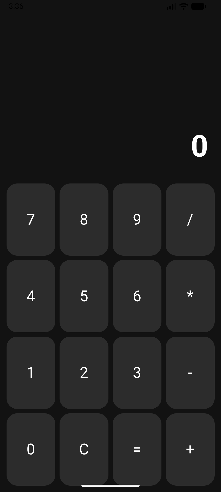

<div align="center"><h1>Tauri Calculator</h1></div>

<div align="center"></div>

           

This project is a cross-platform calculator built using Tauri, React (TypeScript), and Rust as part of a university assignment.  
It demonstrates how a modern frontend can be combined with a high-performance Rust backend to perform arithmetic operations.

The project also supports Android build using Tauri Android tools.

<div align="center"><h3>Features</h3></div><hr>

- Basic arithmetic operations:
  - Addition (+)
  - Subtraction (-)
  - Multiplication (*)
  - Division (/)

- Rust-powered backend for calculations
- Error handling (e.g. divide by zero, invalid operator)
- Clean and responsive UI
- Cross-platform support (Desktop + Android)

<div align="center"><h3>Tech Stack</h3></div><hr>

- Frontend: React + TypeScript
- Backend: Rust
- Framework: Tauri
- Styling: CSS (Grid + Flexbox)
- Mobile: Tauri Android

<div align="center"><h3>Project Structure</h3></div><hr>

```
calculator/
│
├── src/                 # React frontend
│   ├── App.tsx
│   ├── App.css
│   └── main.tsx
│
├── src-tauri/           # Rust backend
│   ├── src/
│   │   ├── main.rs
│   │   └── lib.rs
│
└── package.json
```

<div align="center"><h3>How It Works</h3></div><hr>

- User interacts with the calculator UI (React)
- Input is stored in state
- On "=" press, React calls Rust using Tauri `invoke`
- Rust performs the calculation
- Result is returned and displayed in UI

<div align="center"><h3>Build From Source</h3></div><hr>

Before building, make sure you have installed all Tauri prerequisites ([Full setup guide](https://tauri.app/start/prerequisites/)):
* Rust (latest stable)
* Node.js (LTS)
* Tauri CLI
* Android build tools (optional, for Android build)

1. Clone the repository

    ```bash
    git clone https://github.com/your-username/tauri-calculator.git
    ```
    
2. Navigate to the project directory

    ```bash
    cd tauri-calculator
    ```

3. Install frontend dependencies

    ```bash
    npm install
    ```

- Build for Production (Desktop)

    ```bash
    cargo tauri build
    ```

 - Build for Android

    ```bash
    cargo tauri android build
    ```


<div align="center"><h3>Acknowledgements</h3></div><hr>

This project was developed by Mohammad Amin Asli as part of a university assignment.
Special thanks to ChatGPT for assistance during development and guidance.

<div align="center"><h3>License</h3></div><hr>

This project is licensed under the **MIT License**.
